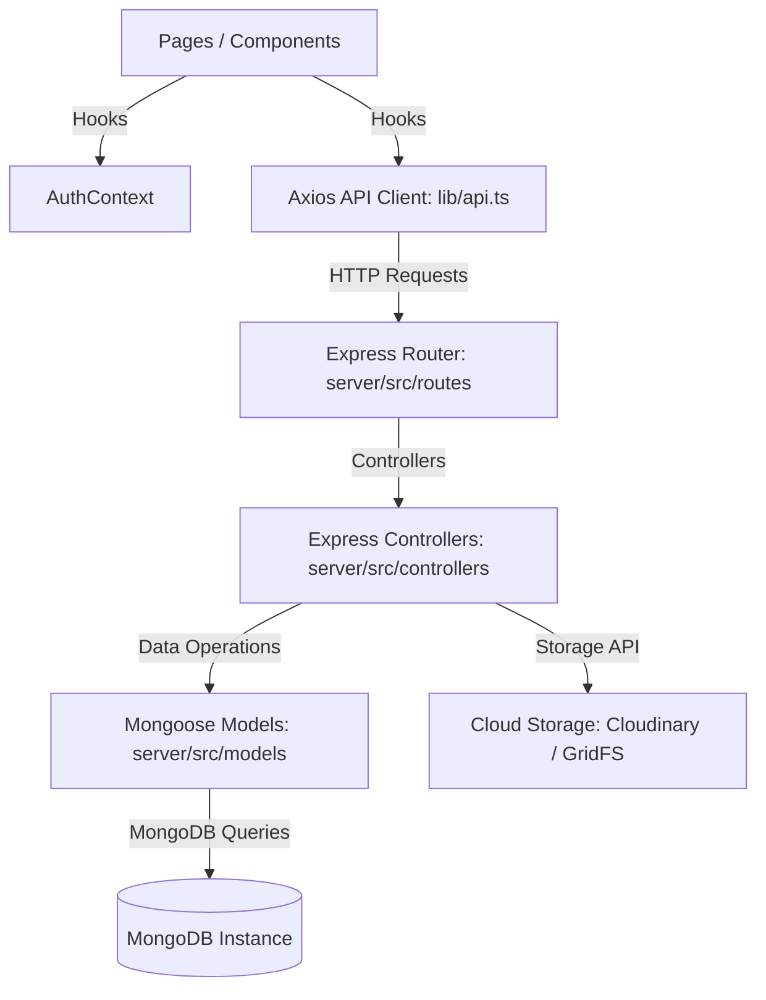

# Dependency Graph (dependency-graph.md)

This maps structural file relationships, flow hierarchies, and module networks in NoteMitra.

---

## 1. Application Layer Dependency Flow

---

## 2. Key Import Chains
- **Client Root Layout**:
  - [layout.tsx](file:///c:/Users/pavan/OneDrive/Desktop/UXI_Works/NoteMitra_MIC_website/client/app/layout.tsx) imports [globals.css](file:///c:/Users/pavan/OneDrive/Desktop/UXI_Works/NoteMitra_MIC_website/client/app/globals.css) and wraps layout children in `AuthProvider` (from `lib/context/AuthContext`) and `Navbar` (from `components/Navbar`).
- **Client Auth Integration**:
  - [AuthContext.tsx](file:///c:/Users/pavan/OneDrive/Desktop/UXI_Works/NoteMitra_MIC_website/client/lib/context/AuthContext.tsx) imports `authAPI` from `lib/api.ts` to log users in/out and fetch session state.
- **Backend Entrypoint**:
  - [server-enhanced.js](file:///c:/Users/pavan/OneDrive/Desktop/UXI_Works/NoteMitra_MIC_website/server/server-enhanced.js) imports middlewares, DB models, and executes the Express listen event on port 5000.
