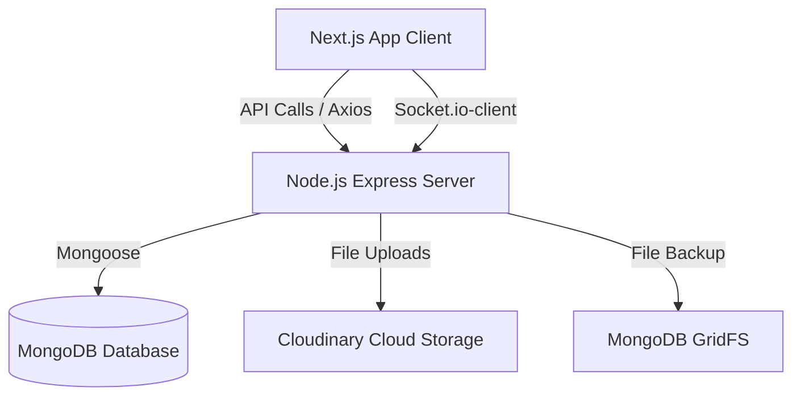

# Master Memory (master-memory.md)

Welcome, Agent! This is the compressed project intelligence for **NoteMitra**. Read this first to get up to speed.

---

## 1. Project Overview & Core Mission
NoteMitra is a student notes-sharing platform designed for students to share, download, rate, and discuss academic resources.
- **Client**: Next.js 14 App Router (React, TypeScript, TailwindCSS, Zustand).
- **Server**: Node.js/Express backend, mongoose for MongoDB storage.
- **Storage**: Multer with Cloudinary (primary) and GridFS (fallback) for PDF note uploads.

---

## 2. Key Architecture Summary

---

## 3. Key Engineering Decisions
- **Express Server Entrypoint**: Rather than compiling TS files dynamically in production, the running backend uses a robust, customized script: [server-enhanced.js](file:///c:/Users/pavan/OneDrive/Desktop/UXI_Works/NoteMitra_MIC_website/server/server-enhanced.js).
- **File Upload Strategy**: PDF documents are uploaded directly to Cloudinary (for high-speed global delivery) with a seamless fallback to MongoDB GridFS in case of API rate limits or network issues.
- **Client Auth Integration**: State is managed via `AuthContext.tsx` combined with custom axios request interceptors (`lib/api.ts`) that inject jwt tokens. Response interceptors explicitly bypass auto-redirects on 401 to prevent authorization logout loops.
- **Standalone Mode Disabled in Development**: `output: 'standalone'` is removed from `next.config.js` in dev mode to ensure live-reloading and middleware functions run cleanly.

---

## 4. Crucial Implementation Patterns
- **API Clients**: Built using axios instances in `lib/api.ts` with custom request hooks.
- **Authentication**: Stateful user session verification through Next.js Context API (`AuthProvider`).
- **Interactive Features**: Socket.io for real-time actions and notifications.

---

## 5. Known Issues & Troubleshooting
- **Stale Dev Cache**: Next.js compilation cache (`.next`) can occasionally become stale. Fixed by running `Remove-Item -Recurse -Force .next` and starting dev mode fresh.
- **Service Worker Cache Interception**: A service worker from previous sessions can cache localhost requests and cause `net::ERR_CONNECTION_REFUSED`. If this happens, clear service worker registrations in DevTools and hard refresh.
